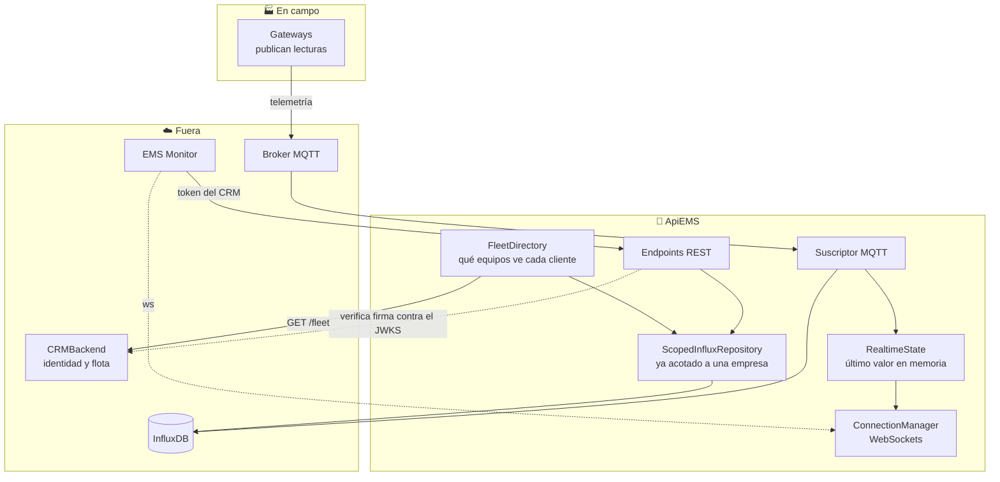

<div align="center">

# 🔌 ApiEMS

### El backend de consumo: escucha MQTT, guarda en InfluxDB y sirve lo que el panel dibuja

[](https://www.python.org/downloads/)
[](https://fastapi.tiangolo.com/)
[](https://www.influxdata.com/)
[](tests/)

[Qué hace](#qué-hace) •
[Instalación](#instalación) •
[Identidad](#identidad-el-crm-firma-apiems-verifica) •
[Variables](#las-variables) •
[Endpoints](#endpoints) •
[Tests](#tests)

</div>

---

## Tabla de Contenidos

- [Qué hace](#qué-hace)
- [Arquitectura](#arquitectura)
- [Requisitos](#requisitos)
- [Instalación](#instalación)
- [Variables de entorno](#variables-de-entorno)
- [Identidad: el CRM firma, ApiEMS verifica](#identidad-el-crm-firma-apiems-verifica)
- [El recorte por cliente](#el-recorte-por-cliente)
- [Las variables](#las-variables)
- [Endpoints](#endpoints)
- [Tiempo real](#tiempo-real)
- [Estructura del proyecto](#estructura-del-proyecto)
- [Tests](#tests)
- [Troubleshooting](#troubleshooting)

---

## Qué hace

ApiEMS está entre los medidores y el panel del cliente. Escucha lo que los
gateways publican por MQTT, lo guarda en InfluxDB, y responde las preguntas que
un panel necesita hacer sobre esos datos.

|                                |                                                                                                          |
| ------------------------------ | -------------------------------------------------------------------------------------------------------- |
| 📥 **Ingesta por MQTT**        | Un suscriptor que recibe cada lectura y la escribe en InfluxDB.                                          |
| 📊 **Consultas de consumo**    | Histórico, energía importada y exportada, costos, comparativas, informes.                                |
| ⚡ **Tiempo real**             | Un WebSocket por variable, alimentado por el mismo flujo MQTT.                                           |
| 🔒 **Aislamiento por empresa** | Cada consulta sale acotada a los equipos de quien pregunta, sin que ningún endpoint tenga que acordarse. |

Lo que **no** hace: emitir identidad. No tiene usuarios, ni contraseñas, ni
tabla de sesiones. Verifica los tokens que firma CRMBackend contra su clave
pública y confía en lo que dicen.

---

## Arquitectura



---

## Requisitos

|             |                                                    |
| ----------- | -------------------------------------------------- |
| Python      | 3.13 o superior                                    |
| InfluxDB    | 2.7, alcanzable y con el bucket creado             |
| Broker MQTT | con TLS en producción                              |
| CRMBackend  | corriendo, con `/.well-known/jwks.json` alcanzable |

---

## Instalación

### 1. Dependencias

```bash
uv venv
source .venv/bin/activate
uv sync --all-extras
```

### 2. Variables de entorno

```bash
cp .env.example .env
nano .env
```

### 3. Credencial de servicio contra el CRM

ApiEMS necesita preguntarle al CRM qué equipos tiene cada cliente. Esa
credencial se emite **desde el panel del CRM**, en Credenciales de servicio, y
se ve una sola vez:

```
CRM_CLIENT_ID=svc_…
CRM_CLIENT_SECRET=svcsec_…
```

### 4. Arrancar

```bash
uv run uvicorn app.main:app --reload --port 8001
```

El puerto 8001 y no 8000 porque CRMBackend suele ocupar el 8000 en la misma
máquina.

---

## Variables de entorno

### InfluxDB

| Variable                                        | Descripción                                                                                                                          |
| ----------------------------------------------- | ------------------------------------------------------------------------------------------------------------------------------------ |
| `INFLUX_URL`                                    | **Con esquema**: `https://…`. Sin él, la aplicación arranca y dice estar lista, pero `ping()` devuelve falso y no hay dato que salga |
| `INFLUX_TOKEN` · `INFLUX_ORG` · `INFLUX_BUCKET` | Credencial y destino                                                                                                                 |

### MQTT

| Variable                      | Descripción                                                                                                           |
| ----------------------------- | --------------------------------------------------------------------------------------------------------------------- |
| `MQTT_HOST` · `MQTT_PORT`     | `8883` con TLS                                                                                                        |
| `MQTT_USE_TLS`                | `true` exige que `MQTT_HOST` sea el nombre del certificado                                                            |
| `MQTT_USER` · `MQTT_PASSWORD` |                                                                                                                       |
| `MQTT_TOPIC` · `MQTT_QOS`     |                                                                                                                       |
| `MQTT_CLIENT_ID`              | **Único**. Dos clientes con el mismo se expulsan mutuamente en un bucle que desde afuera se ve como una red inestable |

### CRMBackend

| Variable                              | Descripción                                             |
| ------------------------------------- | ------------------------------------------------------- |
| `CRM_BASE_URL`                        | De ahí sale el JWKS y el árbol de flota                 |
| `CRM_CLIENT_ID` · `CRM_CLIENT_SECRET` | La credencial de servicio                               |
| `CRM_JWT_AUDIENCE`                    | `monitor`. Un token del CRM con otra audiencia no entra |
| `CRM_JWKS_CACHE_SECONDS`              | Cuánto se cachean las claves públicas                   |
| `CRM_FLEET_CACHE_SECONDS`             | Cuánto se cachea qué equipos tiene cada cliente         |

---

## Identidad: el CRM firma, ApiEMS verifica

ApiEMS no autentica a nadie. Verifica lo que CRMBackend firmó, con su clave
pública, obtenida de `/.well-known/jwks.json`.

Un token pasa tres compuertas, en este orden:

|                             |                                                                                                                        |
| --------------------------- | ---------------------------------------------------------------------------------------------------------------------- |
| 1️⃣ **Audiencia**            | Solo `monitor`. Un token de operador del CRM es válido y aun así no abre el consumo de nadie                           |
| 2️⃣ **Contraseña pendiente** | Un token con alcance `password_change` sale de una contraseña que puso un administrador. Acá vale lo mismo que ninguno |
| 3️⃣ **`puede_ver_consumo`**  | El permiso vive en el CRM y es el único lugar donde se decide                                                          |

```python
algorithms=["RS256"]     # uno solo, nunca una lista
```

Un solo algoritmo y nunca una lista. La clave pública **es pública**: si acá se
aceptara HS256, cualquiera podría firmar usando ese PEM como secreto. Es el
ataque de confusión de algoritmos, y fijar el algoritmo es toda la defensa.

### La excepción del administrador

Un administrador del CRM puede mirar los datos de una empresa con el consumo
apagado. El token lo dice (`impersonated`), y entonces `puede_ver_consumo` deja
de aplicar.

Esa marca decide lo que ve **el cliente**, no quien lo administra — frenar
también al segundo haría imposible revisar una empresa antes de habilitarla.

---

## El recorte por cliente

```python
ScopedInfluxRepository(inner, fleet.device_ids)
```

El recorte por empresa **no lo aplica cada endpoint**: se aplica una vez, en el
objeto que todos usan. Las funciones de servicio siguen recibiendo un
`device_id` opcional y llamando a los mismos métodos, sin saber que el
repositorio que tienen en la mano ya no puede ver otra empresa.

Podría aplicarse en cada endpoint, y sería correcto hasta que alguien agregue
uno nuevo y se olvide.

Un `device_id` ajeno responde **404 y no 403**: confirmar que existe ya sería
contar algo de otro cliente.

---

## Las variables

Los nombres son los de **IEC 61850**, el estándar que usan los medidores. El
mismo nombre viaja por MQTT, queda en InfluxDB y se pide en `?variable=`:

| Nombre                               | Qué es                                 |
| ------------------------------------ | -------------------------------------- |
| `PhV_phsA` · `PhV_phsB` · `PhV_phsC` | Tensión de fase                        |
| `A_phsA` · `A_phsB` · `A_phsC`       | Corriente                              |
| `W_phsA` · `TotW`                    | Potencia activa                        |
| `TotVAr` · `TotVA` · `TotPF`         | Reactiva, aparente, factor de potencia |
| `Hz`                                 | Frecuencia                             |
| `TotWh_import` · `TotWh_export`      | **Contadores** de energía              |

Los identificadores de Python (`Variable.VOLTAGE_A`) siguen en inglés porque
los usan catorce módulos; lo que importa es el valor, que es el que viaja.

**No hay traducción entre medio.** Antes existía una tabla que convertía
`VOLTAGE_A` a `Voltaje_A`, y esa doble lista fue la que rompió el histórico
durante semanas sin que nada avisara.

### Contadores

`TotWh_import` y `TotWh_export` crecen monótonos. **Jamás admiten
`mean`/`max`/`min`**: solo `difference()` para la energía de un rango, y
`last()` para el valor puntual. Promediar un contador da un consumo que no
existe.

### `GET /variables`

Cruza dos fuentes: qué variables tiene cargadas el cliente en el CRM, y cuáles
llegaron a tener una lectura en InfluxDB. **Devuelve solo la intersección.**

Por eso el panel no dibuja una gráfica de fase C para un medidor monofásico:
esa variable no está en la respuesta.

---

## Endpoints

Todos bajo `/api/v1`, todos con `Authorization: Bearer <token del CRM>`.

### Contrato vigente (la refactorización V1/V2 los hizo canónicos)

|                                                                |                                                                                   |
| -------------------------------------------------------------- | --------------------------------------------------------------------------------- |
| `GET /dashboard/summary`                                       | **El panel en una llamada**: potencia en vivo, energía y costos del día/mes, KPIs |
| `GET /dashboard/status`                                        | Conectividad (MQTT/Influx, equipos en línea) — a propósito fuera de `/summary`    |
| `GET /reports/{daily,weekly,monthly,yearly,custom}`            | Informes: consumo, exportación, KPIs, analytics y costos del período              |
| `GET /variables`                                               | Qué se puede graficar, ya cruzado contra InfluxDB                                 |
| `GET /devices`                                                 | Inventario del CRM (los medidores del cliente, incluidos los de gateways caídos)  |
| `GET /history` · `/history/downsample` · `/history/range`      | Series temporales                                                                 |
| `GET /costs/range`                                             | Costo de un rango, con la tarifa que el CRM tenga cargada                         |
| `GET /analytics/summary` · `daily-profile` · `monthly-profile` | Resumen de 30 días y perfiles                                                     |
| `GET /analytics/reactive-quadrants`                            | Energía reactiva por cuadrante (kvarh): Q1/Q2 importada, Q3/Q4 exportada          |
| `GET /analytics/compare`                                       | Comparación A vs B — caso de uso aparte de lo consolidado                         |
| `GET /alerts`                                                  | Alertas recientes                                                                 |
| `WS /ws`                                                       | Lecturas en vivo                                                                  |
| `GET /health`                                                  | Sin dependencias externas                                                         |

### Deprecados (esperando la fase destructiva V3)

Los endpoints que la refactorización sustituyó siguen respondiendo con
`deprecated=True` pero **el panel ya no los llama**: `/consumption`, `/export`,
`/kpis`, `/analytics` (resumen general), `/analytics/max-demand`,
`/analytics/load-factor`, `/analytics/base-load`, `/dashboard/cards`,
`/realtime/latest` y el resto del grupo de reportes duplicados (21 en total). Sin
consumidores, se borran en la fase V3 una vez el nuevo contrato lleve una semana
en producción.

---

## Tiempo real

El token viaja como **subprotocolo**, no en la URL:

```
Sec-WebSocket-Protocol: bearer, <token>
```

Una query string queda escrita en el log de acceso del servidor, en el del
proxy y en el historial del navegador — y el navegador imprime la URL entera
cada vez que una conexión falla.

**El subprotocolo se devuelve en la respuesta, incluso al rechazar.** Un
navegador que no ve confirmado ninguno de los que ofreció cierra la conexión él
mismo, y entonces el código de cierre nunca llega: un rechazo por permisos se
vería igual que una caída de red.

El parámetro `?token=` sigue aceptándose como respaldo, para no dejar afuera a
un navegador con la versión anterior cacheada. Cada uso deja un aviso en los
registros; cuando ese aviso deje de aparecer, ese camino se puede borrar.

---

## Estructura del proyecto

```
app/
├── api/v1/              Un router por dominio
├── core/
│   ├── crm_identity.py    Verificación del token contra el JWKS
│   ├── config.py          Settings
│   └── mqtt/              Cliente y reconexión
├── dependencies/
│   ├── auth.py            Las tres compuertas
│   └── influx.py          Entrega el repositorio YA acotado
├── repositories/
│   ├── influx.py          Flux, sin recortar
│   └── scoped.py          El mismo, confinado a una empresa
├── services/
│   ├── crm/               Cliente del CRM y directorio de flota
│   ├── alerts/            Detector y estado en memoria
│   ├── analytics/         Perfiles y anomalías
│   └── websocket/         ConnectionManager
└── websocket/routes.py  El handshake y sus rechazos
```

---

## Tests

```bash
uv run pytest              # 317 pruebas
uv run ruff check .
uv run pyright app/ tests/
```

Lo que se prueba con más cuidado son los límites: que un cliente no vea los
equipos de otro, que un token de otra audiencia no entre, que un contador no se
promedie.

---

## Troubleshooting

| Síntoma                                              | Causa probable                                                                 |
| ---------------------------------------------------- | ------------------------------------------------------------------------------ |
| Arranca y dice estar listo, pero no sale ningún dato | `INFLUX_URL` sin esquema. `ping()` devuelve falso en silencio                  |
| `Token inválido` con un token que parece bueno       | Falta el extra `pyjwt[crypto]`. Sin él, RS256 falla y el mensaje no lo dice    |
| Reconexiones cada 5 segundos                         | `MQTT_CLIENT_ID` repetido. Dos clientes con el mismo id se expulsan mutuamente |
| El histórico devuelve 0 puntos                       | Los nombres de las variables del CRM y los de InfluxDB no coinciden            |
| El WebSocket falla sin código de cierre              | El servidor no devolvió el subprotocolo. Suele ser una imagen vieja            |
| `503` al pedir cualquier dato                        | No se pudo consultar la flota en el CRM. Se sirve lo cacheado si lo hay        |
